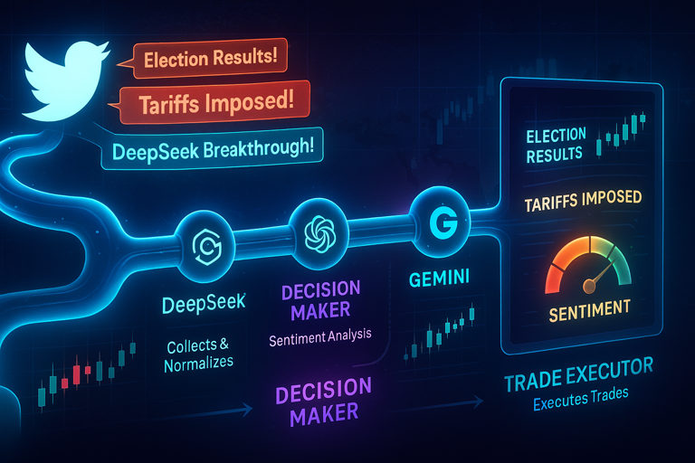

# AI-Powered Sentiment Analysis & Topic Detection Service



An AI-powered sentiment analysis microservice for cryptocurrency token detection and Trump-Zelenskyy meeting analysis, built on a threaded RabbitMQ message processing architecture. The application specializes in analyzing tweets and social media content to detect new cryptocurrency token announcements and Trump-Zelenskyy meeting outcomes using advanced AI agents, automatically publishing snipe and trade actions for downstream systems.

## Features

- **AI-Powered Token Detection**: PydanticAI agents analyze text, images, and web content for cryptocurrency token announcements
- **Geopolitical Meeting Analysis**: Trump-Zelenskyy meeting outcome analysis using Grok-4 via OpenRouter
- **Duplicate Prevention**: Semantic news duplicate detection to prevent redundant analysis
- **Topic-Priority Processing**: Smart workflow that prioritizes meeting analysis over token detection for optimized performance
- **Multi-Agent Architecture**: Specialized agents for text analysis, image OCR, web scraping, topic filtering, duplicate detection, and geopolitical analysis
- **Triple Action Publishing**: Publishes structured snipe actions (tokens), trade actions (sentiment), and notification actions (topic awareness) to `actions_to_take` queue
- **Blockchain Address Validation**: Supports Solana and EVM chains with comprehensive address validation
- **Threaded RabbitMQ Processing**: High-throughput message processing with thread-per-message pattern for concurrent analysis
- **Message Buffer System**: Thread-safe FIFO buffer prevents message loss during RabbitMQ outages
- **RabbitMQ Connection Monitoring**: Automatic health checks and reconnection with configurable retry logic
- **Data Transformation Pipeline**: Tweet standardization with datetime parsing and URL extraction
- **Factory Pattern Architecture**: Clean dependency injection with no global state
- **Comprehensive Observability**: Logfire integration with PydanticAI instrumentation and structured logging
- **Workflow Control**: Configurable topic analysis and token detection workflows with environment variables
- **Comprehensive Testing**: 90%+ test coverage with integration tests for AI agents
- **High Performance**: Thread-per-message processing enables concurrent sentiment analysis with optimal CPU utilization

## Technology Stack

- **Python 3.12** - Modern Python with type hints and advanced features
- **UV** - Fast, modern Python package manager
- **PydanticAI** - AI-powered agents for text analysis, image recognition, and web scraping
- **Pika** - RabbitMQ message consumption, publishing, and connection monitoring
- **Pydantic** - Data validation and schema enforcement with token detection models
- **Structlog** - Structured JSON logging with contextual metadata
- **Logfire** - Observability and instrumentation for PydanticAI agents
- **Base58** - Solana address validation
- **Pytest** - Comprehensive test suite with mocking, coverage, and snapshot testing

## Quick Start

### Prerequisites

**Local Development:**
- Python 3.12+
- UV package manager
- OpenAI API key (for token detection agents)
- OpenRouter API key (for topic analysis agents using Grok-4)
- RabbitMQ server (for message processing)
- Optional: Firecrawl MCP server (for web scraping agent)

**Docker Deployment:**
- Docker and Docker Compose
- OpenAI API key (for token detection agents)
- OpenRouter API key (for topic analysis agents)
- Optional: Firecrawl API key (for enhanced web scraping)

### Installation

1. Clone the repository:
```bash
git clone <repository-url>
cd tweets-notifier
```

2. Install dependencies:
```bash
uv sync
```

3. Configure environment:
```bash
# Create .env file and add your configuration (see Configuration section)
touch .env
```

4. Run the application:
```bash
# Local development
python main.py

# Or using Docker Compose (includes RabbitMQ and Firecrawl)
docker-compose up -d
```

## Configuration

Create a `.env` file with the following variables:

### Core Configuration
```env
ENVIRONMENT=development  # or 'production' for JSON logs
OPENAI_API_KEY=your_openai_api_key_here
OPENROUTER_API_KEY=your_openrouter_api_key_here  # For meeting analysis
```

### RabbitMQ Configuration
```env
RABBITMQ_HOST=localhost
RABBITMQ_PORT=5672
RABBITMQ_QUEUE=tweet_events
RABBITMQ_CONSUME_QUEUE=incoming_messages
ACTIONS_QUEUE_NAME=actions_to_take
RABBITMQ_USERNAME=admin              # Optional
RABBITMQ_PASSWORD=changeme           # Optional
```

### RabbitMQ Connection Monitoring
```env
RABBITMQ_MONITOR_ENABLED=true        # Enable/disable monitoring (default: true)
RABBITMQ_MONITOR_INTERVAL=30         # Health check interval in seconds (default: 30)
RABBITMQ_MAX_RETRY_ATTEMPTS=3        # Max reconnection attempts (default: 3)
RABBITMQ_RETRY_DELAY=5               # Delay between reconnection attempts (default: 5)
```

### Message Buffer Configuration
```env
MESSAGE_BUFFER_ENABLED=true          # Enable/disable buffering (default: true)
MESSAGE_BUFFER_SIZE=10               # Buffer capacity (default: 10)
```

### Analysis Configuration
```env
# Token Detection
SENTIMENT_MODEL_NAME=openai:gpt-4o   # AI model for token analysis (default)
FIRECRAWL_MCP_SERVER_URL=http://localhost:3000/sse  # Optional web scraping
MAX_CONCURRENT_ANALYSIS=5            # Max concurrent agent operations (default: 5)
AGENT_RETRIES=4                      # Retry attempts for failed operations (default: 4)

# Workflow Control
TOPIC_ANALYSIS_ENABLED=true          # Enable topic analysis workflow (default: true)
TOKEN_DETECTION_ENABLED=true         # Enable token detection workflow (default: true)
PEACE_TALKS_TOPIC_ENABLED=true       # Enable Trump-Zelenskyy meeting analysis (default: true)
```

### Logfire Configuration (Optional)
```env
LOGFIRE_ENABLED=true
LOGFIRE_TOKEN=your_logfire_token_here
LOGFIRE_SERVICE_NAME=tweets-notifier
LOGFIRE_ENVIRONMENT=development
SERVICE_VERSION=0.1.0
```

## Architecture

### Threaded AI-Powered Message Processing Design

The system uses a **threaded architecture with AI-powered sentiment analysis and topic analysis** and dependency injection:

- **Main Application** (`main.py`): Application orchestration with threaded message processing for high throughput
- **Threaded Message Handler** (`src/handlers/message_handler.py`): Thread-per-message RabbitMQ processing with dual-action publishing
- **AI Agent System** (`src/core/agents/` package): PydanticAI agents for text, image, web content analysis, topic filtering, duplicate detection, and geopolitical meeting analysis
- **News Database** (`src/core/news_database.py`): Thread-safe in-memory storage for news items with duplicate prevention
- **Sentiment Analyzer** (`src/core/sentiment_analyzer.py`): Topic-priority agent orchestration and result merging
- **MQ Subscriber** (`src/core/mq_subscriber.py`): RabbitMQ consumption and publishing with schema validation
- **Data Transformation** (`src/core/transformation.py`): Tweet standardization and format conversion
- **Schema Validation** (`src/models/schemas.py`): Pydantic models for tokens, tweets, snipe actions, topic analysis, and trade actions
- **RabbitMQ Monitor** (`src/core/rabbitmq_monitor.py`): Connection monitoring with automatic reconnection
- **Message Buffer** (`src/core/message_buffer.py`): Thread-safe FIFO buffer for RabbitMQ outages
- **Address Validators** (`src/core/utils/` package): Blockchain address validation for Solana and EVM chains

### File Structure
```
├── main.py                    # Application entry point with threaded RabbitMQ message processing
├── src/                       # Source code package
│   ├── config/               # Configuration modules
│   │   ├── logging_config.py # Structured logging configuration
│   │   ├── logfire_config.py # Logfire observability configuration
│   │   └── sentiment_config.py # Sentiment analysis and agent configuration
│   ├── core/                 # Core business logic modules
│   │   ├── agents/          # AI sentiment analysis and topic analysis agents
│   │   │   ├── text_search_agent.py # Text content analysis agent
│   │   │   ├── image_search_agent.py # Image text extraction agent
│   │   │   ├── firecrawl_agent.py # Web scraping agent
│   │   │   ├── topic_filter_agent.py # Trump-Zelenskyy meeting outcome filtering
│   │   │   ├── duplicate_detector_agent.py # News duplicate detection agent
│   │   │   ├── geo_expert_agent.py # Geopolitical expert for meeting analysis
│   │   │   ├── topic_sentiment_agent.py # Legacy topic sentiment agent (deprecated)
│   │   │   └── retry_wrapper.py # Exponential backoff retry wrapper for agents
│   │   ├── workflow/        # New workflow orchestration system
│   │   │   ├── orchestrator.py # Main workflow coordinator
│   │   │   ├── state.py     # Workflow state management
│   │   │   ├── branches.py  # Meeting analysis and token detection branches
│   │   │   ├── topic_filtering.py # Topic filtering workflow step
│   │   │   ├── duplicate_detection.py # Duplicate detection workflow step
│   │   │   ├── token_detection.py # Token detection workflow step
│   │   │   ├── meeting_analysis.py # Meeting analysis workflow step
│   │   │   ├── error_handling.py # Workflow error handling
│   │   │   └── utils.py     # Workflow utilities and agent result merging
│   │   ├── utils/           # Utility functions
│   │   │   └── address_validators.py # Blockchain address validation
│   │   ├── sentiment_analyzer.py # Main sentiment analysis orchestration
│   │   ├── news_database.py # Thread-safe news storage for duplicate detection
│   │   ├── mq_subscriber.py # RabbitMQ message consumption and publishing service
│   │   ├── message_buffer.py # Thread-safe FIFO message buffer
│   │   ├── transformation.py # Tweet data transformation pipeline
│   │   └── rabbitmq_monitor.py # RabbitMQ connection monitoring
│   ├── handlers/             # Message handlers package
│   │   ├── tweet.py         # Tweet message handler with transformation and sentiment analysis
│   │   └── message_handler.py # Threaded RabbitMQ message handler with thread-per-message processing
│   └── models/               # Data models and schemas
│       └── schemas.py       # Pydantic models for tokens, tweets, actions, meeting analysis, and duplicate detection
├── tests/                    # Comprehensive test suite with AI agent integration tests
├── examples/                 # Example files and sample data (includes Trump-Zelenskyy analysis notebooks)
├── docs/                     # Documentation files
├── logs/                     # Log files (auto-created)
└── docker-compose.yml        # Multi-service Docker orchestration
```

## Development Commands

### Running the Application
```bash
# Run the application
python main.py

# Install dependencies
uv sync

# Add new dependencies
uv add <package-name>
```

### Testing
```bash
# Run all tests
uv run pytest tests/ -v

# Run specific test categories
uv run pytest tests/test_mq_subscriber.py -v
uv run pytest tests/test_mq_subscriber_reconnect.py -v
uv run pytest tests/test_rabbitmq_monitor.py -v
uv run pytest tests/test_transformation.py -v
uv run pytest tests/test_message_buffer.py -v
uv run pytest tests/test_tweet_handler.py -v
uv run pytest tests/test_get_trade_action.py -v
uv run pytest tests/test_address_validators.py -v
uv run pytest tests/test_retry_wrapper.py -v
uv run pytest tests/test_message_handler.py -v
uv run pytest tests/test_main_rabbitmq.py -v

# Run AI agent integration tests (requires OPENAI_API_KEY)
OPENAI_API_KEY=your_key uv run pytest tests/integration/test_agents_integration.py -v

# Run tests with coverage
uv run pytest tests/test_mq_subscriber.py --cov=src.core.mq_subscriber --cov-report=term-missing
uv run pytest tests/test_message_handler.py --cov=src.handlers.message_handler --cov-report=term-missing
uv run pytest tests/test_sentiment_analyzer.py --cov=src.core.sentiment_analyzer --cov-report=term-missing

# Skip integration tests (run only unit tests)
uv run pytest -m "not integration" -v

# Update snapshots when agent responses change
uv run pytest tests/integration/test_agents_integration.py --snapshot-update
```

## Key Components

### AI Agent System

#### Token Detection Agents
- **TextSearchAgent**: Analyzes tweet text content for token announcements and blockchain addresses
- **ImageSearchAgent**: Extracts text from images and analyzes for token information using OCR
- **FirecrawlAgent**: Scrapes linked websites for token announcement content
- **Chain Detection**: Supports Solana and 20+ EVM chains with automatic address validation

#### Topic Analysis Agents
- **TopicFilterAgent**: Filters tweets for Trump-Zelenskyy meeting actionable outcomes using Grok-4
- **DuplicateDetectorAgent**: Prevents news duplication using semantic analysis with Grok-4
- **GeoExpertAgent**: Analyzes meeting outcomes for geopolitical impact and peace likelihood using Grok-4
- **News Database**: Thread-safe in-memory storage preventing duplicate analysis
- **Geopolitical Intelligence**: Specialized analysis for diplomatic meeting outcomes
- **News Source Optimization**: Optimized for major outlets (@BBCBreaking, @Reuters, @AP, @FoxNews)

#### Agent Orchestration
- **Topic-Priority Logic**: Smart workflow that checks topic relevance before running expensive token detection
- **Multi-Agent Coordination**: Concurrent execution with result merging and priority logic
- **Dual-Path Processing**: Optimized branching between topic analysis and token detection workflows

### Action Publishing System

#### Snipe Actions (Token Detection)
- **Automatic Detection**: When `TokenDetails` are found, publishes structured snipe actions
- **Message Format**: Standardized JSON with `action: "snipe"` and token parameters
- **Token Parameters**: Includes chain ID, chain name, and contract address

#### Trade Actions (Meeting Analysis)
- **Geopolitical Analysis**: When Trump-Zelenskyy meeting outcomes are detected, publishes trade actions with score-based parameters
- **Outcome-Based**: Trading parameters automatically adjusted based on 1-10 overall peace likelihood score
- **Risk Management**: Built-in leverage and margin controls with take profit and stop loss parameters
- **Message Format**: Standardized JSON with `action: "trade"` and comprehensive trading parameters

#### Notification Actions (Topic Awareness)
- **Complete Visibility**: Every tweet passing topic filter and receiving alignment score triggers notification
- **Universal Publishing**: Published regardless of trading threshold, ensuring no topic-relevant content is missed
- **Tweet Context**: Includes original tweet text, author, timestamp, and alignment score
- **Dual Publishing**: High scores (≥6) publish both `notify` and `trade` actions; low scores publish only `notify`
- **Message Format**: Standardized JSON with `action: "notify"` and complete tweet metadata

#### Queue Integration
- **Unified Queue**: All action types (snipe, trade, notify) published to configurable `actions_to_take` queue
- **Downstream Services**: Trading and analysis services consume appropriate action types
- **Complete Coverage**: Notification actions ensure all topic-relevant content is tracked
- **Error Handling**: Comprehensive error handling with logging and buffering support

### Threaded Message Processing Pipeline
- **Thread-per-Message**: Each message processed in dedicated thread for concurrent sentiment analysis
- **High Throughput**: Multiple messages processed simultaneously without blocking
- **Factory Pattern**: Clean dependency injection using `create_message_handler()` factory  
- **Thread-Safe Operations**: Safe message acknowledgment using `connection.add_callback_threadsafe()`
- **Tweet Analysis**: Processes incoming tweets through AI sentiment analysis pipeline without blocking
- **Schema Validation**: Pydantic models for tweets, tokens, and snipe actions
- **Data Transformation**: Tweet standardization with datetime parsing and URL extraction
- **Graceful Shutdown**: Waits for all processing threads to complete during application shutdown
- **QoS Configuration**: Configurable max concurrent threads to prevent system overload

### RabbitMQ Connection Monitoring
- **Automatic Health Checks**: Periodic connection monitoring with configurable intervals
- **Intelligent Reconnection**: Automatic reconnection with retry limits and exponential backoff
- **Background Operation**: Non-blocking monitoring in dedicated daemon threads
- **Status Tracking**: Real-time connection state monitoring and failure counting

### Message Buffer System  
- **FIFO Queue**: Thread-safe message storage during RabbitMQ outages
- **Automatic Overflow**: Oldest messages removed when buffer reaches capacity
- **Seamless Integration**: Automatic buffering on connection failures, automatic flush on reconnection
- **Configurable Capacity**: Environment-configurable buffer size and behavior

## Testing

Comprehensive test suite with **90%+ coverage** across **100+ tests**:

### Test Categories
- **AI Agents**: Sentiment analysis orchestration, agent coordination, result merging
- **Agent Integration**: Real-world AI agent testing with live API calls and snapshot validation
- **Address Validation**: Blockchain address validation for Solana and EVM chains
- **RabbitMQ Subscriber**: Message consumption, publishing, buffering, reconnection (43 tests)
- **RabbitMQ Monitor**: Health checks, reconnection, thread management (23 tests)
- **Message Buffer**: Thread safety, FIFO operations, integration (27 tests)
- **Data Transformation**: Schema validation, datetime parsing, URL extraction (27 tests)
- **Tweet Handler**: Message processing with sentiment analysis integration
- **Threaded Message Handler**: Thread-per-message processing pattern and factory testing (20 tests)

### Running Tests
```bash
# Run all tests with verbose output
uv run pytest tests/ -v

# Run specific test modules
uv run pytest tests/test_mq_subscriber.py::TestMQSubscriberPublish -v
uv run pytest tests/test_sentiment_analyzer.py::TestSentimentAnalyzer -v
uv run pytest tests/test_address_validators.py::TestAddressValidation -v

# Run AI agent integration tests (requires OpenAI API key)
OPENAI_API_KEY=your_key uv run pytest tests/integration/test_agents_integration.py -v
```

### Snipe Action Testing

The application includes comprehensive testing for the snipe action workflow:

```bash
# Test snipe action message creation and publishing
uv run pytest tests/test_tweet_handler.py -v

# Test message handler factory pattern
uv run pytest tests/ -k "message_handler" -v

# Test complete sentiment analysis to snipe action pipeline
OPENAI_API_KEY=your_key uv run pytest tests/integration/ -v
```

## Analysis Workflows

The application implements **topic-priority analysis** that branches between token detection and Trump-Zelenskyy meeting analysis with duplicate prevention:

## Token Detection Workflow (Snipe Actions)

When topic analysis determines content is not related to Trump-Zelenskyy meeting outcomes, the system runs cryptocurrency token detection:

### 1. Tweet Processing
```bash
# Incoming tweet message from RabbitMQ queue
{
  "id": "12345",
  "text": "🚀 New token launching on Ethereum! Contract: 0x742d35Cc6765C0532575f5A2c0a078Df8a2D4e5e",
  "author_name": "crypto_trader",
  "created_at": "Sat Jul 19 22:54:07 +0000 2025"
}
```

### 2. AI Analysis
- **TextSearchAgent** analyzes tweet content for token announcements
- **ImageSearchAgent** processes any attached images for token information
- **FirecrawlAgent** scrapes linked websites for additional token details
- Results are merged with priority logic (`TokenDetails` > `ReleaseAnnouncement` > `NoTokenFound`)

### 3. Automatic Snipe Action Publishing
When `TokenDetails` are detected, a snipe action is automatically published:

```json
{
  "action": "snipe",
  "params": {
    "chain_id": 1,
    "chain_name": "Ethereum",
    "token_address": "0x742d35Cc6765C0532575f5A2c0a078Df8a2D4e5e"
  }
}
```

### 4. Downstream Integration
- **Queue**: Published to `actions_to_take` queue (configurable via `ACTIONS_QUEUE_NAME`)
- **Next Service**: Downstream trading services consume snipe actions for automated token acquisition
- **Error Handling**: Failed publishes are buffered during RabbitMQ outages

## Topic Analysis Workflow (Trade Actions)

When topic analysis determines content relates to Trump-Zelenskyy meeting actionable outcomes, the system runs duplicate detection and geopolitical analysis:

### 1. Topic Filtering
```bash
# Incoming news tweet from major outlet
{
  "id": "67890",
  "text": "BREAKING: Trump and Zelenskyy announce $50B aid package and NATO membership timeline after White House meeting",
  "author_name": "BBCBreaking",
  "created_at": "Mon Aug 18 18:30:15 +0000 2025"
}
```

### 2. Trump-Zelenskyy Meeting Analysis
- **TopicFilterAgent** analyzes content for Trump-Zelenskyy meeting actionable outcomes
- **DuplicateDetectorAgent** checks against NewsDatabase to prevent duplicate analysis
- **GeoExpertAgent** analyzes all stored outcomes for geopolitical impact (1-10 peace likelihood score)
- **NewsDatabase** stores unique news items for comprehensive analysis
- **Contextual Understanding**: Leverages Grok-4's geopolitical knowledge
- **Semantic Analysis**: Infers relevance even without explicit date/location mentions

### 3. Automatic Action Publishing
When meeting outcomes are analyzed and not duplicates, both notification and trade actions are automatically published:

**Notification Action (Always Published):**
```json
{
  "action": "notify",
  "params": {
    "source": "BBCBreaking",
    "text": "BREAKING: Trump and Zelenskyy announce $50B aid package and NATO membership timeline after White House meeting",
    "createdAt": 1724000215,
    "alignment_score": 8
  }
}
```

**Trade Action (Published when overall_score ≥ 6):**
```json
{
  "action": "trade",
  "params": {
    "pair": "ETHUSDT",
    "side": "long",
    "leverage": 7,
    "margin_usd": 500,
    "take_profit_percent": 20,
    "stop_loss_percent": 12
  }
}
```

**Score-Based Action Logic**:
- **All scores**: Notification action always published for complete visibility
- **Overall score < 6**: Only notification action published (trade below threshold)
- **Overall score 6-7**: Notification + moderate trading with `leverage=5`, `margin_usd=300`
- **Overall score > 7**: Notification + aggressive trading with `leverage=7`, `margin_usd=500`
- **All trades**: Fixed parameters - `pair="ETHUSDT"`, `side="long"`, `take_profit_percent=20`, `stop_loss_percent=12`
- **Duplicates**: No actions published (duplicate prevention)
- **Overall score N/A or None**: Only notification action published

### 4. Downstream Integration
- **Queue**: All actions published to same `actions_to_take` queue (snipe, trade, notify)
- **Trading Services**: Consume trade actions with ready-to-use parameters
- **Monitoring Services**: Consume notification actions for complete topic awareness
- **Risk Management**: Pre-configured leverage, margins, and stop-loss parameters reduce downstream complexity
- **Complete Coverage**: Notification actions ensure no topic-relevant content is missed, regardless of trading thresholds

## Logging

Structured logs are automatically written to the `logs/` directory with rotation (10MB, 5 backups):

- **`error.log`** - ERROR level messages only
- **`warning.log`** - WARNING level and above  
- **`app.log`** - All application logs (INFO and above)

**Environment Control**: 
- `ENVIRONMENT=development` - Console output with colors
- `ENVIRONMENT=production` - JSON-formatted logs for analysis

## Docker Deployment

The application supports containerized deployment with Docker Compose for easy multi-service orchestration.

### Docker Compose Architecture

The `docker-compose.yml` defines a complete ecosystem with three services:

#### Services Overview

**1. RabbitMQ Message Broker**
```yaml
rabbitmq:
  image: rabbitmq:3.13-management
  ports:
    - "5672:5672"   # AMQP protocol
    - "15672:15672" # Management UI
```
- **Purpose**: Message broker for tweet processing and snipe action publishing
- **Management UI**: Available at `http://localhost:15672` (admin/changeme)
- **Persistence**: Uses named volume for message durability
- **Health Checks**: Automated port connectivity validation

**2. Firecrawl MCP Server**
```yaml
firecrawl:
  image: node:18-alpine
  command: npx -y firecrawl-mcp
  ports:
    - "3000:3000"   # MCP server endpoint
```
- **Purpose**: Web scraping service for FirecrawlAgent
- **Integration**: Enables analysis of linked websites in tweets
- **Optional**: Service can be disabled if web scraping is not needed

**3. Sentiment & Topic Analyzer (Main Application)**
```yaml
sentiment-analyzer:
  build: .
  depends_on:
    - rabbitmq
    - firecrawl
```
- **Purpose**: Main threaded message processing with dual-path analysis (token detection + topic analysis)
- **AI Models**: Supports both OpenAI (token detection) and OpenRouter/Grok-4 (topic analysis)
- **Dependencies**: Waits for RabbitMQ and Firecrawl to be healthy before starting
- **Volumes**: Mounts `./logs` for persistent log access from host
- **Environment**: All configuration passed via environment variables

### Network Architecture

**Custom Bridge Network** (`trading_network`):
- **Isolation**: Services communicate securely within isolated network
- **Service Discovery**: Automatic DNS resolution (e.g., `rabbitmq:5672`)
- **Scalability**: Easy to add additional services to the network

### Docker Commands

```bash
# Start all services in background
docker-compose up -d

# View logs for specific service
docker-compose logs -f sentiment-analyzer
docker-compose logs -f rabbitmq
docker-compose logs -f firecrawl

# View logs for all services
docker-compose logs -f

# Rebuild and restart services after code changes
docker-compose up -d --build

# Stop all services
docker-compose down

# Stop services and remove volumes (clean slate)
docker-compose down -v

# Access RabbitMQ Management UI
# Navigate to http://localhost:15672
# Default credentials: admin/changeme (configurable via .env)
```

### Environment Integration

All configuration from your `.env` file is automatically passed to containers:

```env
# Example .env for Docker deployment
ENVIRONMENT=production
OPENAI_API_KEY=your_openai_api_key_here
OPENROUTER_API_KEY=your_openrouter_api_key_here  # For meeting analysis
RABBITMQ_USERNAME=admin
RABBITMQ_PASSWORD=changeme
FIRECRAWL_API_KEY=your_firecrawl_key_here  # Optional
LOGFIRE_TOKEN=your_logfire_token_here      # Optional
LOGFIRE_SERVICE_NAME=sentiment-analyzer    # Service name for Logfire
LOGFIRE_ENVIRONMENT=production             # Environment for Logfire
SERVICE_VERSION=0.1.0                     # Version for observability

# Workflow Control
TOPIC_ANALYSIS_ENABLED=true
TOKEN_DETECTION_ENABLED=true
PEACE_TALKS_TOPIC_ENABLED=true  # Enable Trump-Zelenskyy meeting analysis
```

### Service Health Monitoring

Each service includes health checks:
- **RabbitMQ**: Port connectivity validation every 10 seconds
- **Firecrawl**: HTTP endpoint availability every 15 seconds  
- **Sentiment Analyzer**: Python process validation every 30 seconds

### Production Deployment

For production use:
1. **Update credentials** in `.env` file
2. **Set ENVIRONMENT=production** for JSON logging
3. **Configure log rotation** for the mounted logs directory
4. **Monitor health checks** for service availability
5. **Use reverse proxy** for external access if needed

### Volume Management

- **`rabbitmq_data`**: Named volume for RabbitMQ message persistence
- **`./logs`**: Bind mount for accessing application logs from host
- **Data persistence**: Messages and logs survive container restarts

## Contributing

1. Fork the repository
2. Create a feature branch
3. Add tests for new functionality (maintain 90%+ coverage)
4. Ensure all tests pass: `uv run pytest tests/`
5. Follow the existing code patterns and dependency injection architecture
6. Submit a pull request with clear description

## Support

For issues and questions, please open a GitHub issue with:
- Python version and environment details
- Relevant log excerpts from `logs/` directory
- Steps to reproduce any issues